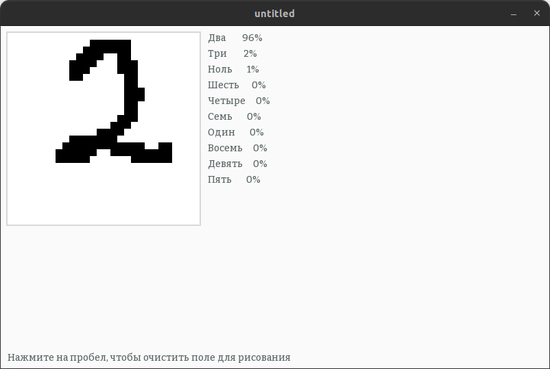

# О проекте
Данная программа демонстрирует принцип работы простейших нейронных сетей.  
Нейронная сеть уже создана, обучена и используется по-умолчанию, но Вы можете создать свою и обучить самостоятельно, отредактировав [код](src/main.cpp).  
Программа использует графический интерфейс, чтобы дать пользователю возможность самостоятельно проверить качество нейронной сети.

## Зависимости
* **SFML**