# Нейронная сеть, распознающая рукописные цифры
Используемая **нейронная сеть** является **многослойным перцептроном**.  
**Нейронная сеть** уже обучена и ее данные хранятся в каталоге **../data/DigitRecognizer.cfg**, но функционал для самостоятельного обучения оставлен.  
В репозитории содержится **70 000 JPG** изображений в разрешении **28x28**, причем **60 000** изображений используются для обучения **нейронной сети**, а оставшиеся **10 000** - для проверки качества нейронной сети. Изображения были составлены при помощи библиотеки **MNIST** и хранятся в каталоге **../data/images**.  
Дальнейшее изучение репозитория рекомендуется начать с файла **../src/main.cpp**.
## О проблеме многослойного перцептрона
Точность обученной **нейронной сети** на библиотеке **MNIST** достигает почти **100%**, то есть это практически точность человека. Но взглянув на данные в тестируемой выборке можно заметить, что все цифры приблизительно одинакового размера и написаны ровно в середине изображения:  
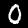 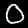 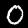  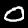   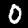  
         
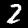     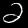 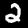   
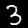 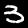 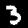 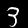  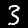 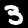   
 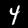 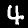  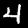 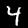 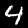   
   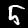  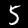    
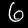  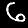 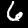 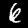 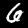 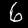 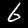  
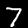  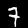 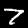 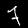 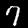  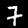  
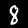 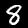 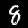 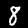   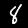 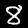  
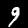 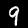 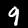  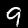 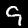 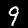 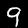  
Подобное явление связано с историей получения этих изображений. Важно, что на практике получить такое идеальное расположение цифр почти никогда не возможно и цифры будут разного размера и в разных частях изображения.  
Проблема заключается в том, что **многослойный перцептрон** не способен классифицировать изображение, если объект на нем находится в другом месте. То есть ноль, написанный в середине изображения, и ноль, написанный в левом верхнем углу изображения, — разные объекты для **перцептрона**.  
Все это приводит к тому, что если Вы нарисуете свои собственные изображения в фоторедакторе, а потом загрузите их в эту **нейронную сеть** через демонстрационную программу, то Вы получите точность не выше **50%**, что хоть и намного лучше случайного выбора, но несмотря на это очень мало.  
Для решения этой проблемы были созданы **сверточные нейронные сети**, чей механизм скопирован с механизма зрительной системы у животных. На данный момент идет разработка такой **нейронной сети** в ветке **CNN** этого же репозитория, но если по умолчанию выбрана эта ветка, то это значит, что реализация **сверточной нейронной сети** еще не готова.